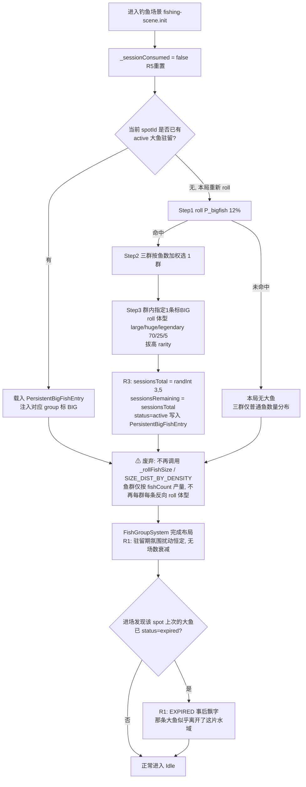
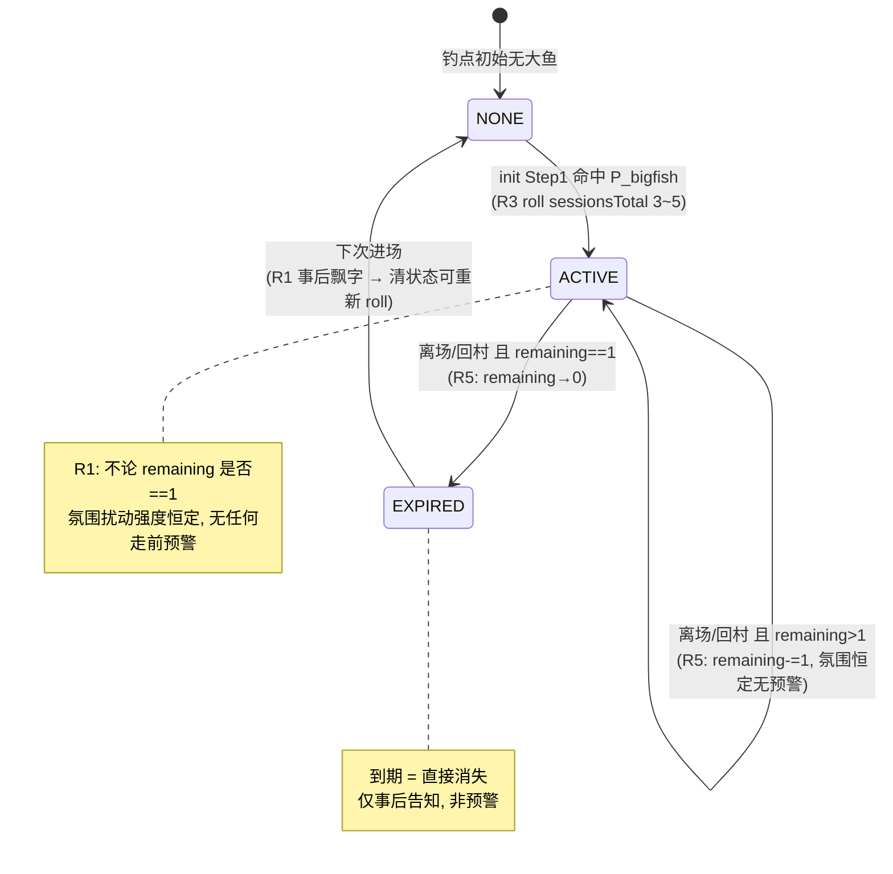

# PHASE 21-1 D12｜大鱼驻留 · 最终封板 + init() 改造 impl-spec

> 版本：v1.0（FINAL LOCK，2026-06-03）
> 状态：老板已拍 R1–R5，本文为交付 CodeBuddy 的实施级设计。
> 范围：仅大鱼驻留（D11 需求1 全局 roll）+ R1–R5 五点裁决落地。**不含**节奏（邀测前/后）与需求5 UX——老板未拍，本轮不涉及。
> 前置铁律已执行：本文所有"删/加/改"均已核对仓库真实代码（见 §0 核仓快照），主程可直接对照编码。

---

## §0 核仓快照（封板前已核，spec 基于此，勿凭记忆）

| 核查项 | 真实现状（代码事实） | 对设计的影响 |
|---|---|---|
| `fish-group-system.js` `init()` | 仍是 **D3 旧逻辑**：`_spawnFish` → `_rollFishSize(g)` 走 `SIZE_DIST_BY_DENSITY`（sparse/medium/dense 反向表）+ 稀疏档保底「3 条全 small 强制第一条 large」。**D11 全局大鱼 roll 完全未落地。** | impl-spec 的「删段」起点 |
| `fishing-scene.js` `init()` (L284) | 末尾 `new FishGroupSystem()` → `.init({canvas, ctx})`。**本身无任何大鱼 / sessionsRemaining 逻辑。** | 全局 roll 的调用方需在此接线 |
| 回村 / 离场出口 | **唯一收口**于 `SceneManager.switchToInstant('village', {spawnAt:{x:21,y:16}})`，两处调用：① `_handleReturnVillage()` (L622，任务完成直接回)；② `_showEscapeConfirm()` 的 `#esc-yes.onclick` (L644，确认回村)。 | R5 递减钩子的真实挂载点（见 §6.4） |
| SceneManager 事件总线 | 有 `emit(event,data)` / `on(event,cb)`，但 `switchToInstant` **不保证**派发离场事件。 | spec 采用「切场景调用前显式插钩子」，**不依赖**不确定的离场事件名，最稳 |
| 鱼饵模型 `bait-effects.js` | `basic/advanced/legendary_bait`，字段为 `rarityBonus / rarityShift / sizeMul`（稀有度提档 + 重量加成），**不是「咬钩率 +%」模型**。 | ⚠ 见 §5 口径澄清 |
| `special_bait` | **items.js / shop-ui.js / bait-effects.js 三处全无定义**（纯设计稿）。 | R4「本期不上架」= 本来就没上，无需「下架」动作 |
| `legendary_bait` 可购买性 | **可购买**：`items.js` price=100；`shop-ui.js` `linBuyList = ['basic_bait','advanced_bait','legendary_bait', ...]`（林师傅出售）。 | R4「高级饵仍可买」成立，无需改动 |

---

## §1 R1–R5 裁决落地汇总（受影响设计块）

| 编号 | 老板裁决 | 落地结论 | 状态 |
|---|---|---|---|
| R1 | 倒计时暗示**不用** | 删除所有「到期前预警」逻辑；驻留期氛围**恒定**；到期=直接消失 + **事后**飘字 | §2 |
| R2 | 村庄软提示**做**，文案定死 | 林师傅闲聊「听说好几处出现大货，你还不快点去？」，触发=≥2 钓点驻留大鱼 | §3 |
| R3 | sessionsTotal **随机** | `sessionsTotal = randInt(3,5)`，每条大鱼注入独立 roll | §4 |
| R4 | special_bait → **每日任务奖励，不可买** | 本期封顶 legendary（设计口径 +22%→42%）；special（+30%→50%）留后续追求层 | §5 |
| R5 | 「一场」= **进场即算，回村结算** | 递减时机改为「离开钓鱼场景/回村」，取消「未抛竿不计」豁免 | §6 |

---

## §2 R1 落地 —— 去倒计时暗示（删暗示逻辑）

### 2.1 落地动作（确认删除）
- ❌ 删除 / 不实现：`sessionsRemaining == 1` 时的任何氛围暗示——**水面扰动减弱**、**hover 第三行弱线索变体**全部砍掉。
- ✅ 驻留期间：水面氛围扰动（D11「弱线索·主」）保持**恒定强度**，不随剩余场数衰减。
- ✅ 到期：`sessionsRemaining` 递减到 0 的那次结算后，大鱼标记直接移除（下次进场该鱼群不再有 BIG），**无任何走前预警**。
- ✅ 事后告知：玩家**下次进场**发现大鱼已不在时，触发 EXPIRED 飘字「那条大鱼似乎离开了这片水域」——这是**已经走了之后**的告知，非预警。

### 2.2 体验影响判断（老板要的我的判断）
- **不突兀，反而更对。** 钓鱼的真实体感本就是「鱼情无常」——你今天没去，那条大货可能就走了，没人会提前通知你。给倒计时反而把它做成了「限时副本 BOSS」，廉价化稀缺。
- 「某次回来直接发现它走了」的轻微失落感，恰是驱动「下次别犹豫、看到就去」的情绪燃料，与 R2 村庄催促形成「机会要主动抓」的合力。
- 唯一风险：玩家若**完全不知道大鱼会过期**，可能误以为是 bug。→ 由 §2.1 的 EXPIRED 事后飘字承接解释，**足够**，不需要额外预警。

---

## §3 R2 落地 —— 林师傅村庄软提示

### 3.1 落地规格
| 项 | 定稿 |
|---|---|
| 文案 | **「听说好几处出现大货，你还不快点去？」**（定死，"大货"=钓鱼黑话，不得改成「大鱼/大家伙」） |
| 说话人 | 林师傅 |
| 触发条件 | **≥2 个钓点同时驻留大鱼**（依赖跨钓点大鱼状态，见 §7 存档依赖） |
| 形态 | 林师傅常规闲聊气泡 / 对话，非弹窗、非强提示 |

### 3.2 我的判断（老板要的）
- **由林师傅说合适。** 林师傅是资深钓友 + 装备店主，「大货」黑话出自他口最贴人设；旁白会显得系统化、出戏。秀兰是收鱼的，语感不如林师傅对路。**维持林师傅。**
- **与 R1 不冲突，可并存。** 关键区分：
  - R1 禁止的是「**针对具体某条鱼**的剩余场数预警」（精确到「这条还剩 1 场」）。
  - R2 是「**泛泛的氛围催促**」——它不告诉你是哪个钓点、哪条鱼、还剩几场，只说「好几处有大货」。它是「全局机会信号」，不是「单鱼倒计时」。
  - 「还不快点去」的催促意味，指向的是「大货是稀缺机会、别拖」这一**长期心态**，不泄露任何单条鱼的到期信息 → **两者正交，并存无矛盾。**

---

## §4 R3 落地 —— sessionsTotal 随机

- `sessionsTotal = randInt(3, 5)`（含 3、含 5）。
- **每条大鱼注入时独立 roll**（不是全局共用一个值）。
- 注入即固化，整个驻留生命周期不变。
- 设计意图（保留）：制造「有的鱼急脾气 3 场就走、有的耐磨 5 场」的个体差异感。
- `sessionsRemaining` 初值 = `sessionsTotal`。

---

## §5 R4 落地 —— 补给闭环重锚 + 加成阶梯（⚠ 含口径澄清）

### 5.1 ⚠ 必读口径澄清（核仓发现，主程务必知悉）
设计文档历史里的「咬钩率 +22% / +30%」「封顶 42% / 50%」是 **D5 阶段的设计层口径**，用于论证补给闭环。**当前代码 `bait-effects.js` 并不存在「咬钩率 +%」字段**，实际鱼饵走的是：
```
rarityBonus  (稀有鱼概率提升)   advanced_bait = 0.30
rarityShift  (稀有度直升档位)   legendary_bait = 1
sizeMul      (重量倍率)         advanced 1.1 / legendary 1.25
```
- 「让大鱼更愿意咬钩」这一闭环效果，在现有模型里由 `rarityBonus / rarityShift` 承载（提高钓到高稀有度/大鱼的概率），**不是**新增一个「咬钩率」数值。
- 本期**不要求**主程新增「咬钩率 +%」字段。下方阶梯表的「+22%/+30%/42%/50%」是**设计意图标注**，落地仍复用现有三参数模型。若后续要把 special_bait 实装为独立「咬钩率」维度，属后续版本设计，本期不碰。

### 5.2 更新后的加成阶梯表（本期实装 vs 后续）
| 档位 | 鱼饵 | 设计口径加成 | 现有代码字段 | 获取方式 | 本期状态 |
|---|---|---|---|---|---|
| 0 | basic_bait 初级 | 基线 | 全 0 | 林师傅购买 ¥5 | ✅ 已实装 |
| 1 | advanced_bait 高级 | +12%（示意） | rarityBonus 0.30 / sizeMul 1.1 | 林师傅购买 ¥20 | ✅ 已实装 |
| 2 | legendary_bait 传说 | **+22% → 实达 42%** | rarityShift 1 / sizeMul 1.25 | 林师傅购买 ¥100 | ✅ **本期封顶** |
| 3 | special_bait 特制 | +30% → 50% | （无字段，待后续设计） | **每日任务完成领取，不可购买** | ⛔ **后续版本** |

> 表注：「→ 42% / 50%」为设计层咬钩率封顶口径，非代码字段；本期最高可达档位 = legendary（档位 2）。

### 5.3 重锚后的补给闭环（确认成立）
- **本期闭环（成立）**：发现大鱼驻留 → 回村找林师傅买 `legendary_bait`（¥100，rarityShift +1）→ 带高级饵回钓点 → 显著提升钓中大鱼概率。「回村补给买饵」闭环**最高到 legendary，本期完整成立**。
- **追求目标层（后续）**：`special_bait` = 后续版本的每日任务奖励，**不可购买**。它是给硬核玩家的进阶激励，且「不可购买 = 防止纯氪金顶到天花板」，守住一点非 P2W 底线。
- **结论**：R4 修订后闭环逻辑**成立且更健康**——本期补给闭环不依赖 special_bait，少了它闭环照样自洽；special_bait 抽离为「日常任务追求」反而给后续版本留了清晰的成长钩子。

### 5.4 「本期封顶 42% / special 留后续」体验评估
- **正面**：本期天花板触手可及（¥100 买得到），玩家「努力就能拿到本期最强饵」，无挫败；special 作为「看得见摸不着的下一站」，制造留存预期。
- **风险**：硬核玩家本期很快摸到 legendary 顶，若大鱼依旧难钓，可能短期觉得「投入到顶了还是钓不到」。→ 缓解靠 R3 的随机驻留场数 + R1 的无常感共同维持「值得反复尝试」，且 special 的后续预告（每日任务）给出「还有更强的在后头」的延展。**本期可接受，无需额外补强。**

---

## §6 R5 落地 —— 「一场」= 进场即算，离场结算（改递减时机）

### 6.1 定义（定稿）
- **进入钓鱼场景即占用一场**（不论是否抛竿、是否钓到）。
- **离开钓鱼场景 / 回村时结算这一场**（递减 `sessionsRemaining`）。
- 取消旧设计的「仅进场观察未抛竿不计」豁免——**进去了就算**，哪怕只看一眼剪影立刻回村也消耗一场。

### 6.2 递减时机迁移（核心改动）
| | 旧设计（D11 前） | D12 新（R5） |
|---|---|---|
| 递减事件 | FISHING_END（抛竿结算后） | **离开钓鱼场景 / 回村**（§6.4 钩子） |
| 未抛竿豁免 | 有（仅观察不计） | **取消** |
| 语义 | 「钓了一杆」算一场 | 「进了一趟」算一场 |

### 6.3 递减作用对象（重要）
递减的是「**本局所在钓点上、当前驻留的大鱼**」的 `sessionsRemaining`。
- 进场时：读取该钓点大鱼状态（若有 BIG 驻留）。
- 离场时：对该钓点驻留大鱼 `sessionsRemaining -= 1`；若减到 0 → 标记过期（下次进场该鱼群不再注入 BIG，并触发 §2.1 EXPIRED 飘字）。
- 该钓点本局**无大鱼驻留**时，离场不触发任何大鱼递减（正常空场）。

### 6.4 挂载点（核仓真实接线，主程照此挂）
递减钩子挂在「回村 / 离场」唯一收口前。**两处都要挂，且只挂一次**（防重复递减）：

```
// fishing-scene.js
// 建议新增私有方法集中处理，避免两处重复
_onLeaveFishingScene() {
  // R5：离场即结算本钓点大鱼一场（无论是否抛竿）
  // 内部需幂等：本局只递减一次（用 this._sessionConsumed 守卫）
  if (this._sessionConsumed) return;
  this._sessionConsumed = true;
  // → 调用大鱼驻留管理（读当前钓点 → sessionsRemaining-1 → ==0 标记过期）
  //   具体落点见 §7 存档依赖，不替主程设计存档结构
}
```
挂载位置（两处，均在 `switchToInstant('village', ...)` **之前**调用 `this._onLeaveFishingScene()`）：
1. `_handleReturnVillage()` (L622)：`taskComplete` 分支，`SceneManager.switchToInstant(...)` 前。
2. `_showEscapeConfirm()` (L644)：`#esc-yes.onclick` 内，`SceneManager.switchToInstant(...)` 前。

> ⚠ 不要依赖 SceneManager 的离场事件——`switchToInstant` 不保证 emit。显式在上述两处插钩子最稳。
> `this._sessionConsumed` 在 `init()` 进场时置 `false`（每次进场重置）。

### 6.5 ⚠ R5 边界负反馈评估（需老板二次确认，见 §9）
见 §9 残留点 1。

---

## §7 PersistentBigFishEntry 字段表（更新，含递减时机变更确认）

> 该结构持久化大鱼**跨局/跨钓点**的驻留状态。**存档结构由主程/存档系统负责设计，本表只列字段语义与依赖，不替主程定 schema/落盘位置。**

| 字段 | 类型 | 语义 | R1–R5 影响 |
|---|---|---|---|
| `spotId` | string | 大鱼所在钓点 id | — |
| `groupId` | enum(left/center/right) | 落在哪个鱼群（Step2 选群结果） | — |
| `sizeTier` | enum(large/huge/legendary) | 体型档（Step3 roll，70/25/5） | — |
| `rarity` | int | 拔高后的稀有度（喂 D5 大概率 heavy） | — |
| `sessionsTotal` | int | 总驻留场数 | **R3：注入时 `randInt(3,5)` 独立 roll** |
| `sessionsRemaining` | int | 剩余场数，初值=`sessionsTotal` | **R5：递减挂「离场/回村」，非 FISHING_END** |
| `status` | enum(active/expired) | 驻留中 / 已过期 | 过期由离场递减到 0 触发；过期后下次进场 EXPIRED 飘字 |

### 7.1 字段是否需因 R5 调整？——**不需要新增/删除字段**
- 递减时机变化（FISHING_END → 离场）**只改「在哪调用递减」，不改字段本身**。`sessionsRemaining` 语义、类型不变，仍是「还能被进场消耗几次」。
- R1 去暗示：**反而可删字段**——若旧设计为「暗示」预留过 `warnShown` / `lastAmbientLevel` 之类字段，R1 后**全部不需要**，确认不引入。
- 唯一新增的是**运行时**（非持久化）守卫 `this._sessionConsumed`（§6.4），它属于 FishingScene 实例态，不进存档。

### 7.2 跨钓点依赖（R2 触发条件）
R2「≥2 钓点驻留大鱼」需要能**遍历所有钓点的 PersistentBigFishEntry** 统计 `status==active` 的钓点数。该聚合查询的数据来源依赖存档层提供「按 spotId 索引的大鱼驻留集合」——**接口由存档系统定义，本文只点明依赖。**

---

## §8 流程图（init 双层 roll + 状态机转移，含 R 改动）

### 8.1 init() 双层 roll 流程（D11 全局 roll + D12 R3/R5 接线）



### 8.2 大鱼驻留状态机（R5 递减 + R1 去暗示）



---

## §9 ⚠ 主程对照编码 —— init() 改造 impl-spec（实施级）

> 目标：把 `fish-group-system.js` 从 D3 旧逻辑改造为 D11 全局 roll + D12 接线，并在 `fishing-scene.js` 挂 R5 离场递减。
> 主程照此「删哪段 / 加哪段 / 改哪个签名 / 新增哪些方法 / 挂哪个事件」即可落地。涉及存档处只点依赖、不替主程设计 schema。

### 9.1 `fish-group-system.js` 改造

**【删】** 以下 D3 残留全部移除：
- 常量 `SIZE_DIST_BY_DENSITY`（sparse/medium/dense 反向概率表）—— D11 已废弃密度→体型反向 roll。
- 方法 `_rollFishSize(group)` 整段删除。
- `init()` 内 `for (const g of this.fishGroups)` 循环里对 `this._rollFishSize(g)` 的调用删除。
- `_spawnFish` 里 `size:'small'` 占位保留（普通鱼默认体型），但**不再被 `_rollFishSize` 覆盖**。
- `FISH_SIZE_VISUAL` **保留**（渲染仍需按 size 取规格；BIG 鱼用最大档 large 视觉，见下）。

**【改函数签名】** `init({ canvas, ctx })` → `init({ canvas, ctx, bigFishPlan })`
- 新增入参 `bigFishPlan`：由 fishing-scene 在调用前算好的全局大鱼计划，结构：
  ```
  bigFishPlan = null            // 本局无大鱼
  bigFishPlan = {               // 本局有大鱼（命中 P_bigfish 或载入已存 active）
    groupId: 'left'|'center'|'right',
    sizeTier: 'large'|'huge'|'legendary',
    rarity: <int>,
  }
  ```
- 向后兼容：`bigFishPlan` 缺省 = `null`，老调用不传则视为无大鱼。

**【加方法】** 新增 `_applyBigFishPlan(plan)`，在 `init()` 末尾（spawn 完三群后）调用：
```
_applyBigFishPlan(plan) {
  if (!plan) return;
  const g = this.fishGroups.find(x => x.id === plan.groupId);
  if (!g || !g.fishes.length) return;
  // 群内指定 1 条标 BIG（取第 0 条或随机一条）
  const target = g.fishes[0];
  target.isBig = true;
  target.sizeTier = plan.sizeTier;
  target.rarity = plan.rarity;
  target.size = 'large';   // 复用现有 large 视觉档（FISH_SIZE_VISUAL.large）
}
```

**【改】** `init()` 末尾循环改为：
```
init({ canvas, ctx, bigFishPlan = null }) {
  // ... 现有 canvas/ctx/fishGroups 写死配置不变 ...
  for (const g of this.fishGroups) {
    for (let i = 0; i < g.fishCount; i++) g.fishes.push(this._spawnFish(g, i));
    // ❌ 删除: this._rollFishSize(g);
  }
  this._applyBigFishPlan(bigFishPlan);   // ✅ 新增：注入本局大鱼
}
```

**【不动】** `update` / `render`（render 已按 `f.size` 取 `FISH_SIZE_VISUAL`，BIG 鱼 size='large' 直接复用，无需改 render）/ `dispose` / `_spawnFish` / `_pickNewTarget` / wander AI 全部保持不变。

### 9.2 全局 roll 逻辑落点（新增，建议独立模块）

**【新增方法 / 模块】** D11 三层 roll 不应塞进 FishGroupSystem（它只负责「布局 + 渲染」）。建议新增 `rollBigFishPlan()`，可放独立小模块（如 `js/systems/big-fish-roll.js`）或 fishing-scene 私有方法：
```
function rollBigFishPlan(fishGroups) {
  // Step1: P_bigfish（建议初值 0.12）
  if (Math.random() >= 0.12) return null;
  // Step2: 三群按 fishCount 加权选 1 群
  const total = fishGroups.reduce((s,g)=>s+g.fishCount,0);
  let r = Math.random()*total, picked = fishGroups[0];
  for (const g of fishGroups){ r -= g.fishCount; if (r<=0){picked=g;break;} }
  // Step3: 体型档 large/huge/legendary 70/25/5
  const t = Math.random();
  const sizeTier = t<0.70 ? 'large' : t<0.95 ? 'huge' : 'legendary';
  const rarity = sizeTier==='legendary' ? 5 : sizeTier==='huge' ? 4 : 3; // 拔高喂 D5 heavy
  return { groupId: picked.id, sizeTier, rarity };
}
```
> 这是「本局新 roll」分支。若该 spot 已有 active 持久化大鱼，则**不 roll**，直接由持久化记录构造 `bigFishPlan`（见 §9.3 与 §7 存档依赖）。

### 9.3 `fishing-scene.js` 改造

**【改 init() L284 区域】** FishGroupSystem 实例化处：
```
this.fishGroupSystem = new FishGroupSystem();
// D12: 先决定本局大鱼计划，再传入 init
this._sessionConsumed = false;                 // R5: 每次进场重置幂等守卫
const spotId = this.questParams?.spotId || /* 当前钓点 id 来源, 依赖存档/场景参数 */;
let bigFishPlan = this._loadActiveBigFishPlan(spotId);   // 已 active → 用存档记录
let isFreshRoll = false;
if (!bigFishPlan) {                            // 无 active → 本局新 roll
  bigFishPlan = rollBigFishPlan(this.fishGroupSystem.fishGroupsPreview?.() || DEFAULT_GROUPS);
  isFreshRoll = true;
}
this.fishGroupSystem.init({ canvas: this.canvas, ctx: this.ctx, bigFishPlan });
if (isFreshRoll && bigFishPlan) {
  // R3: 注入 sessionsTotal=randInt(3,5) 并持久化为 active
  this._persistNewBigFish(spotId, bigFishPlan, 3 + Math.floor(Math.random()*3));
}
// R1: 进场发现该 spot 上次大鱼已 expired → 事后飘字
if (this._consumeExpiredFlag(spotId)) {
  this._showCodexToast('那条大鱼似乎离开了这片水域');
}
```
> 注：`_loadActiveBigFishPlan` / `_persistNewBigFish` / `_consumeExpiredFlag` 三个方法**读写存档**，其实现依赖存档系统提供的大鱼驻留集合接口（§7.2）——**接口与落盘 schema 由主程/存档系统设计，本 spec 不代设计**，仅约定语义：
> - `_loadActiveBigFishPlan(spotId)` → 返回该 spot 的 active 大鱼 `{groupId,sizeTier,rarity}` 或 null。
> - `_persistNewBigFish(spotId, plan, sessionsTotal)` → 写一条 active 记录，remaining=total。
> - `_consumeExpiredFlag(spotId)` → 若该 spot 有刚 expired 待告知记录，返回 true 并清标记。

**【加方法】** 新增 §6.4 的 `_onLeaveFishingScene()`（R5 离场递减，幂等）：
```
_onLeaveFishingScene() {
  if (this._sessionConsumed) return;
  this._sessionConsumed = true;
  const spotId = this.questParams?.spotId || /* 同上 */;
  // 依赖存档接口：该 spot active 大鱼 sessionsRemaining -= 1
  //   减到 0 → status=expired（下次进场触发 §9.3 事后飘字）
  this._decrementBigFishSession(spotId);   // 实现依赖存档系统
}
```

**【挂事件 / 钩子】** R5 递减挂在两处回村出口的 `switchToInstant` **之前**：
- `_handleReturnVillage()` (L622) `taskComplete` 分支：
  ```
  if (this.taskComplete) {
    this.pause();
    this._onLeaveFishingScene();                 // ✅ R5 新增
    SceneManager.switchToInstant('village', { spawnAt: { x: 21, y: 16 } });
  }
  ```
- `_showEscapeConfirm()` (L644) `#esc-yes.onclick`：
  ```
  overlay.querySelector('#esc-yes').onclick = () => {
    overlay.remove(); this.pause();
    this._onLeaveFishingScene();                 // ✅ R5 新增
    SceneManager.switchToInstant('village', { spawnAt: { x: 21, y: 16 } });
  };
  ```
> ⚠ 幂等由 `_sessionConsumed` 保证：两条出口互斥但都走同一方法，且本局只递减一次。

### 9.4 R2 林师傅软提示（村庄侧，非 fishing-scene）
- 在林师傅闲聊触发逻辑处（村庄场景 / 林师傅 NPC 对话系统）新增分支：
  ```
  if (countActiveBigFishSpots() >= 2) {   // 遍历 PersistentBigFishEntry 统计 status==active 的 spot 数
    林师傅说("听说好几处出现大货，你还不快点去？");   // 文案定死
  }
  ```
- `countActiveBigFishSpots()` 依赖 §7.2 存档聚合接口。文案为常量，不可改。

### 9.5 改造影响清单（主程 checklist）
| 文件 | 动作 | 摘要 |
|---|---|---|
| `fish-group-system.js` | 删 | `SIZE_DIST_BY_DENSITY`、`_rollFishSize` 及其调用 |
| `fish-group-system.js` | 改签名 | `init({canvas,ctx})` → `init({canvas,ctx,bigFishPlan})` |
| `fish-group-system.js` | 加 | `_applyBigFishPlan(plan)` |
| `big-fish-roll.js`（新）/ scene 私有 | 加 | `rollBigFishPlan(fishGroups)` 三层 roll |
| `fishing-scene.js` init() | 改 | 进场算/载 bigFishPlan 传入、`_sessionConsumed=false`、expired 事后飘字 |
| `fishing-scene.js` | 加 | `_onLeaveFishingScene()` + 3 个存档桥接方法（依赖存档接口） |
| `fishing-scene.js` 2 处回村出口 | 挂钩 | `switchToInstant` 前调 `_onLeaveFishingScene()` |
| 林师傅对话（村庄侧） | 加 | ≥2 active spot → R2 软提示文案 |
| 存档系统 | 依赖（不代设计） | PersistentBigFishEntry 集合：按 spotId 索引、load active / persist / decrement / expired 标记 / 聚合计数 |
| `bait-effects.js` / `items.js` / `shop-ui.js` | **不动** | special_bait 本期不上架（本就无）；legendary 已可买，无需改 |

---

## §10 需老板二次确认的残留点

1. **⚠（重点）R5「准备往返吃掉一场」边界。**
   - 现象：玩家进场看一眼大鱼剪影 → 发现装备不够（装备引导提示触发）→ 立刻回村升级/补给。这一进一出，按 R5「进场即算」**就消耗了宝贵的 3–5 场之一**。即「玩家想认真准备，反而加速大鱼流失」。
   - 这是否是问题：**我判断是潜在负反馈**——它惩罚了「想做对准备」的玩家，可能催生「裸装硬钓 / 不敢回村补给」的反直觉打法，与 R4「回村买饵」补给闭环**自相矛盾**（回村买饵也算往返、也吃一场）。
   - **不违背老板裁决前提下的推荐缓解方案**（任选其一，待老板拍）：
     - **方案 A（推荐）**：仅当「本场**未抛竿** 且 触发了装备引导提示」时，该场**豁免递减**。守住「真正下竿尝试才算一场」与「准备往返不罚」的平衡，且豁免面极窄（必须未抛竿 + 命中引导），不破坏 R5 大原则。
     - **方案 B**：完全照 R5 不豁免——老板若要的就是「你犹豫/没准备好就会失去机会」的紧张真实感，则现状即终态，无需改。
   - **我的倾向**：方案 A。理由：R5 的精神是「进场认真钓就该算」，而「进场发现没准备好立刻撤」并非一次真实的钓鱼机会消耗，豁免它不削弱紧张感，反而避免与 R4 补给闭环打架。**但这违背了 R5「不再有豁免」的字面，必须老板拍。**

2. **P_bigfish 初值 12%** —— 沿用 D11 建议初值，是否定稿（"很低但≈每 8 局 1 次"）。需老板确认数值。

3. **当前钓点 spotId 的取值来源** —— §9.3 用 `this.questParams?.spotId` 占位。本期是否多钓点、spotId 从何注入（任务参数 / 场景参数），需与存档/关卡数据对齐确认（影响 R2「≥2 钓点」是否本期可成立）。

4. （提示，非本轮）**节奏（邀测前/后）** 与 **需求5 UX** 老板仍未拍，本封板不涉及，待后续。
